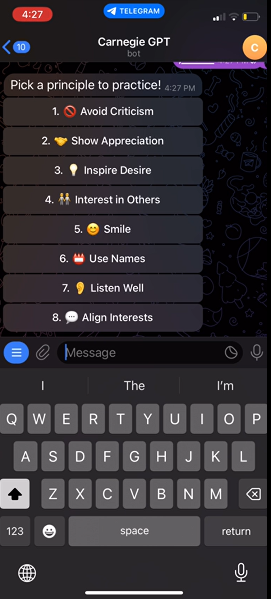

# Overview
CarnegieBot is a unique Telegram bot designed to help users practice and internalize the principles outlined in Dale Carnegie's influential book, "How to Win Friends and Influence People." This bot offers a creative and engaging way to apply these principles in varied, simulated social scenarios.

# Features
## Principle Selection
Users can choose a specific principle from Dale Carnegie's teachings to focus on during their interaction.
## Dynamic Scenario Generation
The bot generates unique scenarios with specific settings and characters, such as an "Airport Lounge" with a character like "Fin, a retired naval officer".
Each scenario is crafted to provide a diverse and challenging environment for practicing the selected principle.
## Diverse Characters and Voices
The bot includes a wide range of characters and voices, each with their own background stories and personalities, ensuring that every interaction feels fresh and engaging.
## Image Classification for Smile Practice
Users can send a photo of their smile to the bot.
The bot uses image classification technology to analyze and provide feedback on the effectiveness of the user's smile, in line with Carnegie's principle on the importance of smiling.
## Smile Highscore
Users can keep track of their progress and improvement in perfecting their smile through a highscore system.
## How It Works
### Start the Bot from the link https://t.me/carnegie_gpt_bot then wse the /menu command in the CarnegieBot conversation on Telegram.

### Select a Principle: Choose which of Dale Carnegie's principles you want to focus on.

### Engage with a Unique Scenario: The bot generates a scenario with a unique setting and character.

### Practice the Principle: Interact with the bot, keeping the chosen principle in mind. The bot’s responses will adapt to help you effectively practice and apply the principle.

### Receive Feedback: After the conversation, the bot provides feedback on how well you adhered to the principle and offers tips for improvement.
